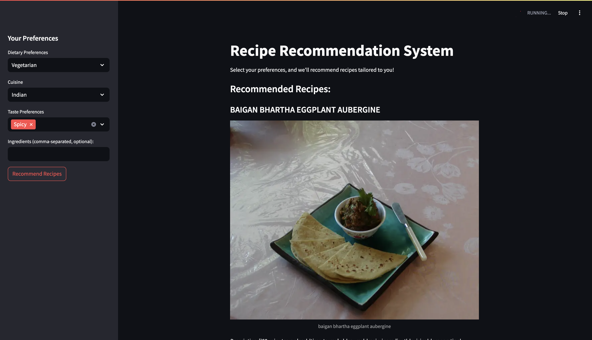

# Receipe Recommender system



Proposal presentation: [https://www.canva.com/design/DAGbEjq_2Wk/SBvAJIN8o4B-QslBMamhVg/edit](https://https://www.canva.com/design/DAGbEjq_2Wk/SBvAJIN8o4B-QslBMamhVg/edit)


## Local Environment

1. Clone the repository
2. Download and save the data set from [Here](https://www.kaggle.com/datasets/shuyangli94/food-com-recipes-and-user-interactions/data?select=RAW_recipes.csv) and save the csv file in the root directory
3. Rename the Downloaded file into "RAW_recipes.csv"
4. Run the `RRS.ipynb` file to create the .pkl files.

### For Mac:

1. Make a python virtual environment

   ```
   python3 -m venv myenv
   source myenv/bin/activate
   pip install -r requirements.txt
   ```
2. According to requirment run the API or Streamlit UI

   ```
   streamlit run 'Receipe Recommendation System'
   python3 'flask_api.py'
   ```

### For Windows:

-------

## Create the docker images (if needed)

1. Respectively rename the docker files (into just 'Dockerfile")
2. run the build commands, ex:

   ```
   docker build --platform linux/amd64 -t isuruudantha/recommendation-system:latest .
   docker build --platform linux/amd64 -t isuruudantha/rec-api:latest .
   ```
3. Push to dockerhub (ex):

   ```
   docker login
   docker tag rec-api isuruudantha/rec-api:latest
   docker push isuruudantha/rec-api:latest
   ```

## Deploy with docker

### StreamlitUI:

1. Pull the image from the dockerhub

   ```docker
   docker pull isuruudantha/recommendation-system:latest
   ```
2. Run the container

   ```
   docker run -p 8501:8501 isuruudantha/recommendation-system:latest
   docker run -p 8501:8501 --restart always isuruudantha/recommendation-system:latest
   ```

### API:

1. Pull the image from the dockerhub

   ```
   docker pull isuruudantha/rec-api:latest
   ```
2. Run the container

   ```
   docker run -p 4321:4321 isuruudantha/rec-api:latest
   docker run -p 4321:4321 --restart always isuruudantha/rec-api:latest

   ```

## API Usage

* End point: `<Hosted IP>:<port>/recommend`
* Body (example):

  ```
  {
    "preference": "spicy",
    "Cuisine": "Indian",
    "taste": "hot",
    "ingredients": "chicken"
  }
  ```
* Response:

  ```
  [
  {
  "name": "Bright Summer Salad Salsa",
  "ingredients": ["grape tomatoes", "avocados", "red onion", "capers", "jalapeno", "lemon juice", "lime juice"],
  "steps": ["Combine ingredients, mix, and chill for 30 minutes"],
  "tags": ["15-minutes-or-less", "vegan", "healthy"]
  },
  {
  "name": "Jalisco Jericalla",
  "ingredients": ["milk", "cinnamon sticks", "vanilla extract", "sugar", "egg yolks"],
  "steps": ["Boil milk with cinnamon, add vanilla and sugar, bake, broil, and refrigerate"],
  "tags": ["desserts", "Mexican", "kid-friendly"]
  },
  {
  "name": "Roasted Poblano and Garlic Salsa",
  "ingredients": ["olive oil", "onion", "habanero", "roasted garlic", "tomatoes", "poblano peppers"],
  "steps": ["Cook onion and habanero, add remaining ingredients, simmer, and seal in jars"],
  "tags": ["spicy", "Tex-Mex", "vegan"]
  }
  ]
  ```
* Error: You will get 401, 500 error for the wrong formats and endpoints requests.

## Current Deployment

* http://159.223.194.167:8501/ - Stremlit UI
* http://159.223.194.167:4321/ - Modal API
* http://159.223.194.167:8000/ - Web UI
* Other:
  * http://159.223.194.167:8080/ - DB (mysql)
